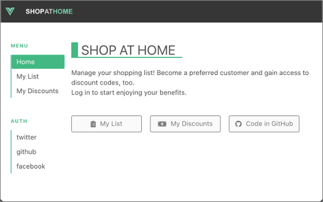

# Azure Static Web Apps Community Kit

Host your own community event on Azure Static Web Apps.

## What's in the kit

* [Presentation slide deck](#presentation-slide-deck)
* [Presentation director's cut](#presentation-directors-cut)
* [Presentation Demos](#presentation-demos)
* [Community Example Apps](#community-example-apps)

### Presentation slide deck

The slide deck features a 37 slide deck with no restrictions on use. Each slide contains notes to help you understand the point for each slide.

The slide deck is in PPTX format. **The animations will work best when running locally in PowerPoint**.

### Presentation director's cut

The director's cut is a video walking through the slides in an actual presentation format. It includes commentary throughout to make it easier for you to give this presentation on your own after watching the video.

### Presentation demos

The demos used in the presentation are offered in the 4 formats: 

1. Angular
1. React
1. Vue
1. Svelte

Each is documented and all implement the same application. Select the demo that works best for your audience.

### Community Example Apps

We have curated a list of community apps that you can refer to as live examples running on Azure Static Web Apps. All of these applications are open-source, and show off various technologies for implementations of static sites.

[Static Web Apps Examples Gallery](https://github.com/microsoft/static-web-apps-gallery-code-samples)

